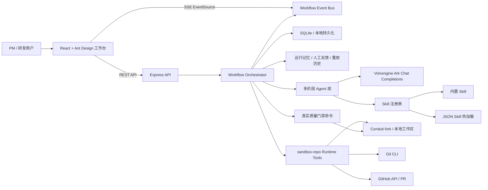
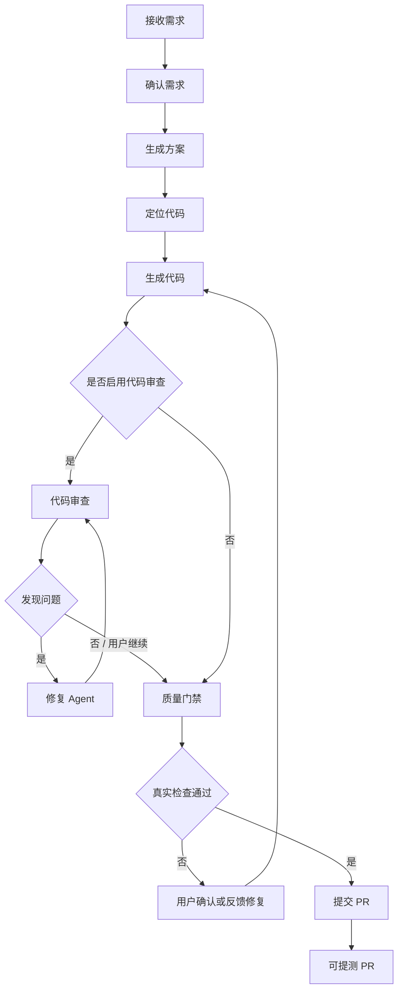

# AI Delivery Workspace 项目文档

## 1. 基础信息

| 字段 | 内容 |
| --- | --- |
| 项目名称 / 课题 | AI Delivery Workspace |
| 项目定位 | 面向代码交付任务的 AI 工作台：从 PM 输入需求开始，自动完成需求确认、方案生成、代码定位、代码生成、代码审查、质量门禁与 PR 提交。 |
| 团队名称 | 待补充 |
| 成员名单 | 待补充：姓名 / 学校 / 专业 / 角色 |

### 1.1 团队成员与角色

| 成员 | 学校 | 专业 | 角色 | 主要职责 |
| --- | --- | --- | --- | --- |
| 待补充 | 待补充 | 待补充 | 产品 / PM | 需求场景设计、验收流程、演示脚本 |
| 待补充 | 待补充 | 待补充 | 前端 | React 工作台、阶段驾驶舱、Diff 审查、设置页 |
| 待补充 | 待补充 | 待补充 | 后端 / Orchestrator | Workflow 编排、SSE、SQLite 持久化、Git/GitHub 操作 |
| 待补充 | 待补充 | 待补充 | Agent / Skill | Agent 提示词、Skill 注册表、代码审查与修复链路 |
| 待补充 | 待补充 | 待补充 | 测试 / 部署 | 端到端验证、脚本维护、本地与容器化部署 |

### 1.2 分工说明

- 前端：负责 `FrontEnd/` 中 Dashboard、项目任务中心、Workflow Run 工作台、设置页、Skill 管理页、Diff 审查 UI 与响应式布局。
- 后端：负责 `Backend/` 中 Express API、Workflow 状态机、SSE 推送、SQLite 存储、Git/GitHub 命令封装与运行指标统计。
- Agent：负责需求接收、确认需求、生成方案、定位代码、生成代码、代码审查、质量门禁、提交 PR 等阶段的提示词与结构化输出 schema。
- Skill：负责内置 Skill 与 JSON Skill 注册、关键词生成、Skill 命中、Skill 对执行模式和 Prompt 的增强。
- 上下文工程：负责仓库上下文读取、文件树召回、变更文件定位、运行记忆、人工反馈、重放历史与断点恢复。
- 测试：负责 Vitest 单元测试、TypeScript 类型检查、API smoke test 与关键端到端路径验证。
- 部署：负责前后端启动脚本、环境变量配置、Docker Compose 与本地 Demo 环境维护。

## 2. 功能说明

### 2.1 端到端使用流程

1. PM 在项目任务中心输入自然语言需求，例如“在文章详情页展示正文纯文本字数，并补充计算逻辑测试”。
2. AI Delivery Workspace 先将原始需求整理为任务标题、交付范围和初始上下文，并进入确认需求阶段。
3. 系统把需求拆成用户故事、验收标准和关键决策项，PM 可逐项确认、补充约束或要求重新生成。
4. 确认后，AI 生成交付方案并定位代码模块，结合仓库文件树、运行记忆和命中的 Skill 选择实现路径。
5. 生成代码阶段会产出真实文件变更与 Git 风格 Diff，同时补齐必要的单元测试文件。
6. 可选的代码审查阶段会基于真实 Diff 给出问题、风险和检查清单；如存在问题，可触发修复 Agent 再次修复并复审。
7. 质量门禁阶段运行项目中真实可用的 lint、test、build、typecheck 等命令，并记录命令、退出码和输出摘要。
8. 最后提交 PR 阶段生成可编辑的分支名和 Commit 信息，用户确认后系统提交代码、推送远端并创建 GitHub PR，PM 获得可提测的 PR 链接。

### 2.2 核心页面

- Dashboard：展示最近工作区、最近任务状态、创建/导入项目入口。
- Project Workspace：项目任务中心，包含新任务输入区、Prompt chips、最近运行列表与上下文状态。
- Workflow Run：当前任务驾驶舱，包含阶段条、Banner、结构化输出、决策确认、Diff 审查、历史重放与主操作按钮。
- Settings：配置 Git/GitHub Token、工作流执行模式、是否启用代码审查、Skill 列表与 Skill 编辑。

## 3. 交付材料

| 材料 | 链接 / 说明 |
| --- | --- |
| 在线 Demo 链接 | 本地 Demo：`http://localhost:5173/dashboard`；后端 API：`http://localhost:3001/api` |
| 体验账号 | 本地 Demo 暂不需要登录 |
| 演示视频链接 | 待补充：建议 3–8 分钟，展示“输入需求 → 生成代码 → 代码审查 → 质量门禁 → 提交 PR”完整链路 |
| AI 系统主仓 | `git@github.com:Alpha5402/conduit-delivery-lab.git` |
| Conduit fork 子仓 | 待补充公开链接；本地示例位于 `workspace/conduit-realworld-example-app` |
| README / 运行说明 | 根目录 `README.md`、后端 `Backend/README.md`、本文件 `PROJECT.md` |

## 4. README / 运行说明

### 4.1 项目简介

AI Delivery Workspace 是一个端到端 AI 代码交付工作台。它将传统“需求沟通、方案拆解、找代码、写代码、补测试、跑验证、提 PR”的链路拆成可观察、可确认、可重放的阶段，并通过 Skill 注册表把特定场景的工程经验注入到 Agent 执行中。

### 4.2 目录结构

```text
.
├── Backend/                  # Node.js + Express + TypeScript 后端
│   ├── src/agents/            # 各阶段 Agent 与提示词
│   ├── src/agentRuntime/      # sandbox repo 工具调用与 Git/GitHub 工具
│   ├── src/domain/            # Workflow 类型、Zod schema、领域模型
│   ├── src/routes/            # REST API 与 SSE 路由
│   ├── src/services/          # Workflow 编排、设置、存储、指标、验证器
│   ├── src/skills/            # Skill 注册表、内置 Skill、JSON Skill loader
│   └── src/workflowExecution/ # 步骤确认策略与 resolver
├── FrontEnd/                  # React + Vite + Ant Design 前端
│   ├── src/api/               # API client 与 SSE 订阅
│   ├── src/components/        # 通用组件
│   ├── src/features/          # workflow/repository/workspace 类型与选择器
│   └── src/routes/            # Dashboard、Project、Workbench、Settings 页面
├── workspace/                 # 本地 sandbox repo / Conduit fork 工作区
├── docker-compose.yml         # 容器化启动入口
└── PROJECT.md                 # 项目交付文档
```

### 4.3 依赖环境

- Node.js 22+（后端使用 `node:sqlite`，建议保持 Node 22）
- npm
- Git
- 可访问的 GitHub 仓库与 Token（用于 clone / push / PR）
- 火山引擎 Ark Chat Completions API Key 与模型名

### 4.4 启动步骤

后端：

```bash
cd Backend
npm install
cp .env.example .env
npm run dev
```

前端：

```bash
cd FrontEnd
npm install
cp .env.example .env
npm run dev
```

访问：

```text
http://localhost:5173/dashboard
```

### 4.5 配置说明

后端配置文件：`Backend/.env`

```bash
PORT=3001
NODE_ENV=development
ARK_API_KEY=
ARK_BASE_URL=https://ark.cn-beijing.volces.com/api/v3
ARK_MODEL=
CONDUIT_REPO_PATH=
CORS_ORIGIN=http://localhost:5173

GIT_USER_NAME=
GIT_USER_EMAIL=
GITHUB_TOKEN=
# GIT_AUTH_TOKEN=
# SKILL_CONFIG_DIR=./skills
GITHUB_BASE_BRANCH=main
GITHUB_REMOTE=origin
# GITHUB_OWNER=
# GITHUB_REPO=
```

前端配置文件：`FrontEnd/.env`

```bash
VITE_API_BASE_URL=http://localhost:3001/api
```

### 4.6 API Key 配置位置

- LLM：在 `Backend/.env` 中配置 `ARK_API_KEY`、`ARK_MODEL`、`ARK_BASE_URL`。
- GitHub：在 `Backend/.env` 中配置 `GITHUB_TOKEN` 或 `GIT_AUTH_TOKEN`，用于 clone、push 和创建 PR。
- Git 用户信息：在 `Backend/.env` 中配置 `GIT_USER_NAME`、`GIT_USER_EMAIL`。
- 前端无需保存 Token；敏感信息只在后端设置页和本地配置中使用，避免提交到仓库。

### 4.7 常用验证命令

```bash
cd Backend && npm test
cd Backend && npm run typecheck
cd FrontEnd && npm test
cd FrontEnd && npm run build
```

## 5. 技术说明

### 5.1 系统架构图



### 5.2 Agent / Workflow 流程图



### 5.3 核心技术栈

| 层 | 技术 |
| --- | --- |
| 前端 | React 18、TypeScript、Vite、Ant Design、React Router、EventSource/SSE |
| 后端 | Node.js、TypeScript、Express 4、Zod、Vitest |
| 数据库 / 存储 | SQLite、本地 JSON Skill 文件、工作区缓存 |
| 模型层 | Volcengine Ark Chat Completions-compatible API |
| Agent 编排 | 自研 Workflow Orchestrator、步骤确认策略、运行记忆、结构化输出校验 |
| Skill 系统 | 内置 Skill、JSON Skill CRUD、关键词生成、Skill 命中与 Prompt 注入 |
| 仓库操作 | sandbox repo runtime、Git CLI、GitHub Token、GitHub PR API |
| 实时通信 | Server-Sent Events |
| 部署环境 | 本地开发、Docker Compose 可扩展部署 |

### 5.4 关键工程难点与解决方案

#### 难点 1：LLM 输出不稳定，容易破坏工作流状态

LLM 经常出现 JSON 结构不符合 schema、字段类型错误、输出过长被截断、把 patch 当成完整源码等问题。项目通过 Zod schema 对每个阶段输出做强校验，并在 LLM harness 中加入重试提示、截断诊断和错误原因暴露。对于代码生成阶段，系统禁止普通 LLM 输出大段源码 JSON，要求通过 runtime 工具读取/写入真实文件，避免“看起来有 diff，实际无法落盘”的假结果。

#### 难点 2：上下文召回与 Skill 命中需要既精准又可解释

代码定位不能只凭技术栈猜测文件，否则会改错模块。系统在 module mapping 阶段结合仓库文件树、Agent Guide、历史运行记忆和 Skill 匹配结果输出 touchedModules。Skill 注册表支持内置 Skill 与 JSON Skill，并通过关键词生成、适用步骤、文件 glob、执行模式覆盖等信息影响 Agent Prompt 和确认策略。前端会展示命中的 Skill，方便用户理解 AI 为什么选择某条实现路径。

#### 难点 3：跨栈类型一致性与前后端状态同步

WorkflowRun、StepRun、VerificationResult、CodeReviewResult 等结构同时被前端展示和后端写入，如果双写类型很容易漂移。项目使用后端 domain schema 作为核心事实源，前端 workflow 类型与后端结构保持镜像，并通过 API client 和 SSE 将 run snapshot 作为页面主要状态来源。这样前端不维护另一套复杂状态机，而是围绕服务端状态渲染。

#### 难点 4：断点重放、人工反馈与自动续跑容易互相覆盖

用户可能在任意阶段补充反馈、重放、还原历史版本或继续执行。系统为每个 step 保存 history snapshot，并在 replayFromStep 时清理下游 output/input/interventions，避免旧决策污染重放结果。自动续跑增加版本号保护，旧的后台 promise 不能覆盖新的重放状态。

#### 难点 5：质量门禁必须是真实检查，不能展示假状态

早期质量门禁容易出现“unit_tests 失败 / build 失败 / typecheck 失败”但没有真实命令输出的情况。当前设计要求 verification 阶段从项目中探测可用命令，真实执行 lint、test、build、typecheck，并记录 command、cwd、exitCode、duration、stdout/stderr 摘要；如果没有可运行命令，则不展示虚假的质量门禁内容。

## 6. 结果说明

### 6.1 项目亮点 / 创新点

1. 阶段化 AI 交付驾驶舱：把端到端代码交付拆成可确认、可重放、可观察的工作流，而不是一次性聊天式生成代码。
2. Skill 驱动的工程经验复用：通过内置 Skill 与 JSON Skill 热加载，将特定改动模式、上下文召回策略、执行模式和 Prompt 约束沉淀为可复用能力。
3. 真实仓库闭环：系统不止生成方案，还能写入本地 sandbox repo、展示 Git 风格 Diff、执行真实质量门禁、提交 Commit、Push 并创建 PR。

### 6.2 评测方案与样例结果

建议评测维度：

| 维度 | 指标 | 样例记录方式 |
| --- | --- | --- |
| 需求理解 | 需求标题准确率、决策项覆盖率 | 人工检查 10 个需求样例 |
| 上下文召回 | touchedModules 命中率、误召回文件数 | 与人工标注文件集合对比 |
| 代码生成 | Diff 可应用率、测试文件补齐率 | 检查 `code_generation` 输出与实际文件 |
| 代码审查 | 缺陷发现率、误报率 | 对照人工 Review finding |
| 质量门禁 | 命令真实执行率、失败原因可解释性 | 检查 commands、exitCode、stdout/stderr |
| PR 交付 | 成功创建分支 / Commit / PR 的比例 | 统计 pull_request 阶段成功率 |

当前样例结果可补充：

- Backend 单元测试：待补充最近一次 `npm test` 结果。
- Backend 类型检查：待补充最近一次 `npm run typecheck` 结果。
- Frontend 构建：待补充最近一次 `npm run build` 结果。
- 端到端 Demo：待补充录屏链接和 PR 链接。

### 6.3 性能指标

系统已提供 `/api/metrics` 与前端运行指标展示，可记录：

- Agent 调用次数
- Token 输入 / 输出统计
- 单阶段耗时
- LLM 调用成功率
- Workflow 自动续跑成功率
- Skill 命中率
- 质量门禁通过率

建议在演示视频或最终答辩中展示一次完整 run 的指标条，说明每个阶段的成本和耗时。

### 6.4 用户反馈

已根据交互反馈迭代的方向：

- 移除旧品牌文案，统一为 AI Delivery Workspace。
- 将日志、指标、上下文等低频信息降级，突出当前任务、决策和主操作。
- 合并“准备修改 / 写入变更”为“生成代码”，避免用户在两个相邻阶段来回理解。
- 增加代码审查可选步骤，支持发现问题后修复并复审。
- 要求质量门禁展示真实执行命令，不展示虚假检查结果。

### 6.5 版本迭代记录

| 版本 | 主要变化 |
| --- | --- |
| v0.1 | 建立前后端工作台、Workflow API、基础阶段流转和 SSE 状态同步 |
| v0.2 | 引入项目工作区、最近任务、设置页、Git/GitHub 配置 |
| v0.3 | 重构为 AI Delivery Workspace 信息架构，强化任务驾驶舱 |
| v0.4 | 合并生成代码阶段，加入真实 Diff 展示、单元测试补齐、质量门禁 |
| v0.5 | 引入可选代码审查阶段、审查修复 Agent、PR 提交流程与分支/Commit 可编辑 |

